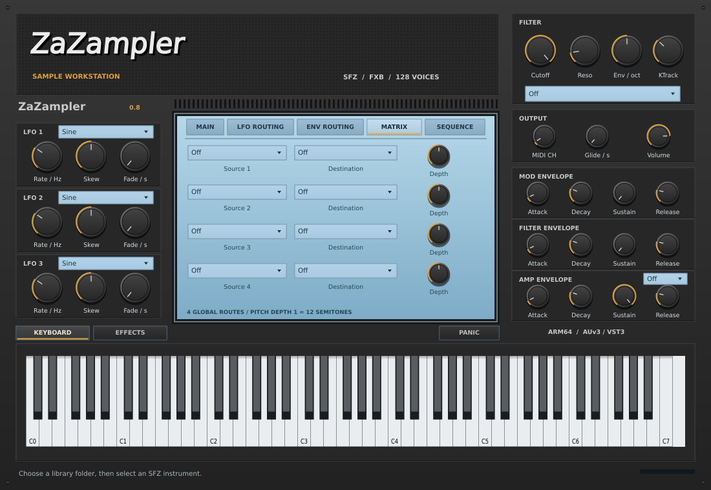
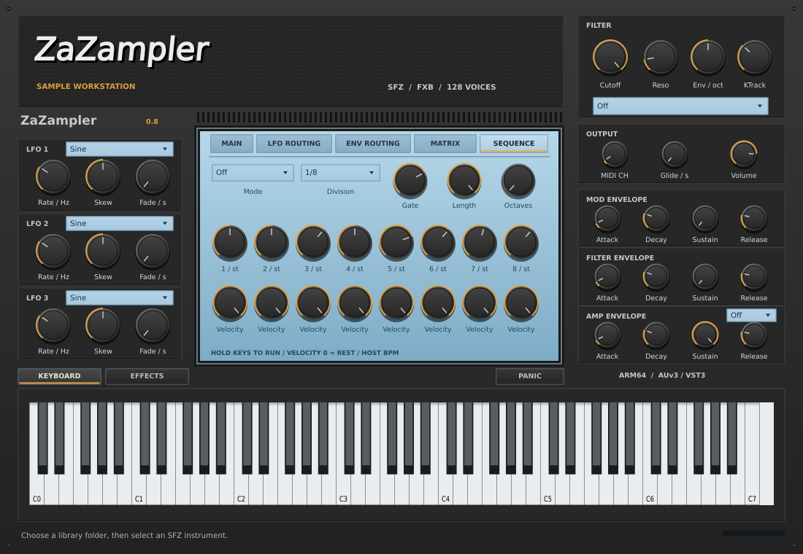
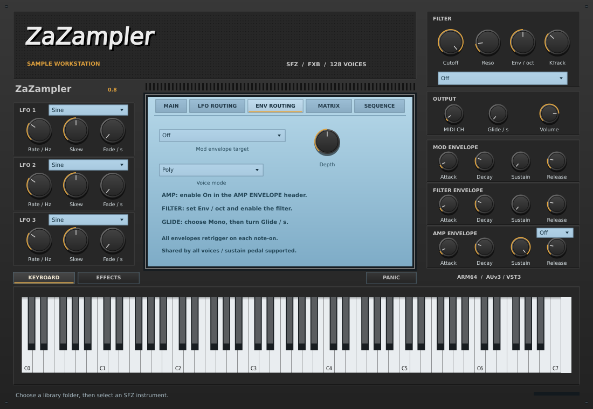
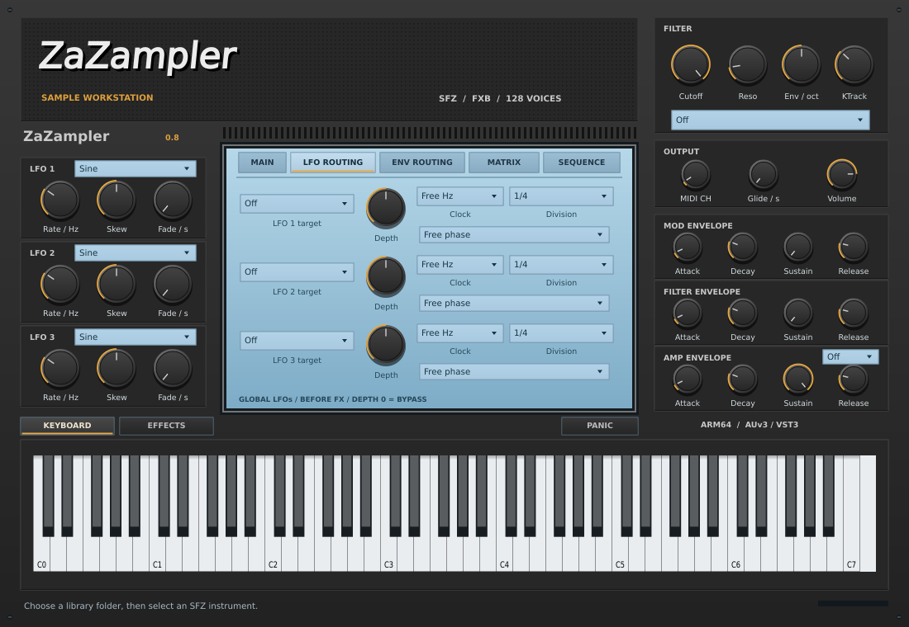
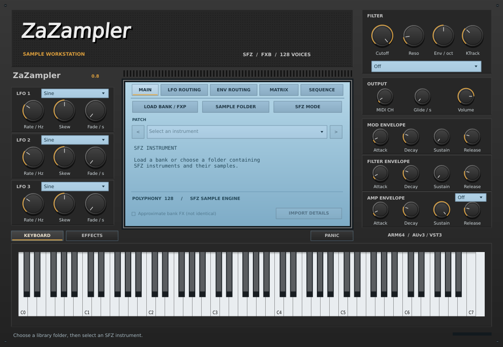

# ZaZampler 0.8 — ZamplerのSFZ音色を利用するサンプラープラグイン

M1 MacBook Pro向け **arm64ネイティブ / AUv3・VST3** のソースプロジェクトです。
互換用にAUv2とStandaloneもビルドします。JUCE 8.0.6 + sfizz 1.2.3を固定コミットで取得します。

macOS arm64のビルド・自動テスト・署名検証をGitHub Actionsで実施しています。
[ReleasesのAssets](https://github.com/nokamoto777/zazampler/releases)から `ZaZampler-macOS-arm64.zip` を取得できます。
開発版はアドホック署名で、Apple公証は含みません。指定のmacOSや各DAWでの起動・演奏は実機確認が必要です。
変更履歴は [CHANGES.md](CHANGES.md)、検証記録は [docs/VALIDATION.md](docs/VALIDATION.md) を参照してください。

## 「Zampler互換」の範囲

Zamplerと同じSFZファイルおよび参照サンプルを読み込む「音色素材の互換」を対象にしています。
Zampler本体の複製、ドロップイン置換、同一音質の再現ではありません。メーカーとの提携はありません。

| 対象 | この実装 |
|---|---|
| SFZ + WAV等のサンプル | sfizzが解釈できる範囲で対応。WAVを回帰テスト済み |
| キー／ベロシティ分割・ループ・エンベロープ | SFZの指定をsfizzで処理 |
| SFZの独自／非対応opcode | 完全互換は保証しない。未知opcodeをステータスに表示 |
| Zamplerの `.fxb` / `.fxp` | 確認済みチャンク形式の音色一覧・SFZ参照・フィルター／FXの近似変換に対応 |
| REX / REX2 / `.rx2` | **未対応**。WAVへの変換だけではスライス／テンポ追従情報は復元されない |
| フィルター・FX | 独自DSPを追加。種類・設定は下記参照。本家のアルゴリズム／出音一致は未検証 |
| LFO | 3基の共通LFOを実装。6波形・テンポ同期・変調先選択。FXB内のLFO／マトリクス設定は未変換 |
| MOD MATRIX・シーケンサー | 4系統の共通マトリクス、Up/Downアルペジオ、8ステップシーケンサーを実装。本家の設定データは未変換 |
| 既存DAWプロジェクトのZampler自動置換 | 非対応。別プラグインとして挿し、MIDIを渡す |
| AUv3 / VST3 / AUv2 | macOS arm64 CIでビルド・署名検証済み。DAW実機検証は未実施 |

Zamplerで購入・取得した全ライブラリがそのまま再現されるとは限りません。
FXB側のフィルター／FXは近似変換です。エンベロープ、LFO、MOD MATRIX、アルペジエーターなどは取り込みません。

## バイナリのダウンロード

1. [GitHub Releases](https://github.com/nokamoto777/zazampler/releases)を開き、利用するビルドの **Assets** を展開します。
2. `ZaZampler-macOS-arm64.zip` をダウンロードして展開します。`Source code` はソースのみです。
3. 展開先へターミナルで移動し、DAWを終了して `bash scripts/install-macos.sh` を実行します。

mainの更新・mainからの手動実行では `ci-実行番号` の開発版Release、`v` タグではそのタグのReleaseを作成します。
ビルド・テストが成功したバイナリとSHA-256チェックサムをAssetsへ保存します。PRの検証ビルドはActionsのArtifactsから取得できます。
詳しくは [docs/GITHUB_ACTIONS.md](docs/GITHUB_ACTIONS.md) を参照してください。

## ウィンドウサイズ

右下のグリップをマウスでドラッグして拡大・縮小できます。対応ホストではウィンドウ枠からもリサイズできます。
既定は1100×760、範囲は660×456～2200×1520です。ノブ・文字・鍵盤を含めて比例拡縮し、異なる縦横比では余白を設けます。

## Macでビルド

必要なもの：フル版Xcode（Command Line ToolsのみではAUv3をビルドできません）、CMake、Git、初回依存取得用インターネット接続。
Xcodeを一度起動して初期設定を完了してください。CMake未導入なら `brew install cmake` などで導入します。

ZIPを展開し、ターミナルでZaZamplerフォルダーに移動して実行：

```bash
bash scripts/build-macos.sh
```

- Xcode generatorを使用し、arm64、最低macOS 12.0でビルドします。
- AUv3はStandaloneアプリ内の `.appex` として組み込まれます。
- 既定はローカル実行用のアドホック署名。配布・公証済みの署名ではありません。
- Xcodeの署名設定にチームが必要な場合は、自分のTeam IDを指定できます。

```bash
DEVELOPMENT_TEAM=あなたのTeamID bash scripts/build-macos.sh
```

生成物：`build-macos/ZaZampler_artefacts/Release/` 配下の `VST3`、`AU`、`AUv3`、`Standalone`。
コードや署名でエラーが発生した場合、エラーを省略せず保存してください。

## インストール

DAWを終了してから実行：

```bash
bash scripts/install-macos.sh
bash scripts/validate-macos.sh
```

| 種類 | 配置先 |
|---|---|
| VST3 | `~/Library/Audio/Plug-Ins/VST3/ZaZampler.vst3` |
| AUv2 | `~/Library/Audio/Plug-Ins/Components/ZaZampler.component` |
| AUv3入りアプリ | `~/Applications/ZaZampler.app` |

インストーラーがStandaloneを一度開きます。その後終了し、DAWを再起動／再スキャンしてください。
AUv3は対応ホストで使用します。Ableton LiveではまずVST3を使用してください。
旧ビルドがある場合は `~/Library/Application Support/ZaZampler/Backups/日時/` に退避します。

## 音色を鳴らす

1. DAWのMIDIトラックにZaZamplerを挿します。
2. **SAMPLE FOLDER** で、SFZと参照サンプルが両方含まれるフォルダーを選択します。
3. 右側のリストから音色を選びます。ステータスが `Loading` から音色名に変わるまで待ちます。
4. MIDIチャンネル1で演奏します。画面下の鍵盤でも確認できます。
5. 同梱の `Demo` フォルダーには自作のサイン波テスト音色があり、追加購入不要で確認できます。

複数フォルダーを相対参照する音色は、その共通親フォルダーを選んでください。
外付けSSDやNASの音色はマウントしてから開きます。ホーム全体やNAS全体を選ぶとSFZ検索に時間がかかるため、音色フォルダーを絞ってください。
AUv3ではフォルダーのセキュリティスコープ付きブックマークを保存し、ストリーミング中はアクセス権を保持します。
別のMacへのプロジェクト移動、AUv3とVST3間の移動、アクセス権失効時は再度フォルダーを選択してください。

## 演奏機能

- **Keytrack**: FILTERのKTrack。C4（MIDI 60）を基準に、1なら鍵盤1オクターブにつきCutoffも1オクターブ移動。−1～2、0で無効。最後に発音した鍵を全ボイス共通の基準にします。
- **Glide**: ENV ROUTINGのVoice modeをMonoにして、OUTPUTのGlide / sを調整。最後に押した鍵を優先し、重ねて押すと指定秒数で前の音程から移動。鍵を離すと残っている鍵へ戻ります。最初の一音は滑らず、Polyでは無効です。
- **MATRIX**: 4行それぞれSource / Destination / Depthを指定。同じLFOを複数の変調先へ送ることもできます。Depth 0で無効、負値で反転。
- **SEQUENCE**: ModeをArp Up / Arp Down / 8-stepにして鍵を押すと開始。DivisionはホストBPM同期（取得できなければ120）。Gateで発音時間、Lengthで1～8のステップ数、Octavesでアルペジオ範囲1～3オクターブを指定。
- **8-step編集**: 上段は基準鍵からの半音差（−24～24）、下段はVelocity倍率（0で休符）。基準鍵は最後に押した鍵。アルペジオでも下段のVelocity列とLengthを使用します。
- **Pitch変調**: LFO、Mod Envelope、Matrixから利用可能。Depth 1は12半音。音声の再生速度へサンプル単位で反映し、既存SFZのpitch bend指定と加算します。

Monoとシーケンサーはサステインペダルに対応し、重複ノート、CC120/121/123、Panic、音色変更、ホスト停止を処理します。Monoの各ノートで音源を再トリガーします。前のノートのリリース音は同じ演奏音程へ追従するため、SFZのReleaseが長ければ余韻は重なります。
モード変更は発音中の音と残響を停止します。切替後は鍵を押し直してください。全設定は保存しますが、進行中のステップ位置や保持中の鍵は保存しません。

MatrixのSourceはLFO 1～3、Amp/Filter/Mod Envelope、Velocity、Key、Mod Wheel、Channel Aftertouch、Pitch Bend。LFOをMatrixのSourceにする場合、左側のWave/Rate/Skew/Fadeを使い、LFO ROUTINGのTarget/Depthとは独立です。Keyは(C4からの半音差)/60、ほかのMIDIソースは0～1（Pitch Bendは−1～1）。
DestinationはCutoff（5オクターブ）、Volume（12 dB）、Pan、Resonance（4 Q）、Drive（24 dB）、Pitch（12半音）。括弧内はDepth 1での基準量。4行の変調量を加算し、最終的に安全なパラメーター範囲へ制限します。




シーケンサーは最初のノートを起点とするテンポ同期です。DAWのPPQ位置へのロック、スイング、ラッチ、外部MIDI出力、本家FXB内のシーケンサー取り込みは含みません。音源として内部のSFZへMIDIを送ります。

## エンベロープ

右側の **MOD / FILTER / AMP ENVELOPE** のADSRを操作できます。確認には同梱の `Demo/Envelope.sfz` を選ぶと長いReleaseも聴き取りやすくなります。

- **Amp**: AMP ENVELOPE見出しの右を **On** にすると有効。Attack/Decay/Releaseは秒、Sustainは0～1。
- **Filter**: Filter typeを有効にし、FILTER内の **Env / oct** を0以外に設定。
- **Mod**: 中央の **ENV ROUTING** でTargetとDepthを設定。



3基とも全ボイス共通で、新しいノートオンで再トリガーし、全キーとサステインペダルが離れるとReleaseへ移行します。
SFZ側のエンベロープと重なって作用します。**SFZ側で音が先に終了する場合、追加ADSRだけでReleaseを延長することはできません。**
旧音色への影響を避けるため、初期値はAmp Off / Filter量0 / Mod Offです。
仕様と例は `docs/ENVELOPES.md` を参照してください。FXB内のADSR設定の自動変換は未対応です。

## LFO

3基を同時に使用できます。まずSFZ音色を読み込み、次のように設定してください。

1. 左の **LFO 1** で波形を選択し、Rateを2 Hz程度に設定。
2. 中央の **LFO ROUTING** を開く。
3. LFO 1 targetを **Volume**、Depthを **0.7** にするとトレモロになります。
4. **Pan** ならオートパン。**Cutoff** なら右側のFilter typeをLP12/LP24等、Cutoffを1,000 Hz程度に設定します。
5. Clockを **Host tempo** にすると、Divisionで選んだ音価へ周期を同期します。



| 項目 | 内容 |
|---|---|
| Wave | Sine / Triangle / Saw up / Saw down / Square / S&H |
| Rate | 自由速度0.01～30 Hz。Host tempo中はDivisionを使用 |
| Skew | 波形の前半・後半の比率。0.5が対称。Squareではパルス幅。S&Hでは影響なし |
| Fade | 0～10秒。ノートオンから変調量が増加。和音でも各ノートオンで再開始 |
| Target | Off / Cutoff / Volume / Pan / Resonance / Drive / Pitch |
| Depth | −1～+1。0で無効、負値で極性反転 |
| Division | 1/32～4小節、付点・三連を含む11種類。1小節は4拍固定 |
| Phase | Free phase / Note retrigger。後者はノートオンの位置で位相をリセット |

Cutoffは最大±5オクターブ、Resonanceは最大±4 Q、Driveは最大±24 dBを基準値に加えます。
Cutoff/ResonanceはフィルターがOffだと聴感上変化せず、DriveにはSaturation Amountを上げる必要があります。
Volumeは0～1の減衰によるトレモロ、Panは元のステレオ信号の左右バランスです。
Volume/PanはFX入力の手前なので、ディレイ／リバーブの残響を最後段で揺らす動作ではありません。

このLFOは全ボイス共通です。PitchはDepth 1で±12半音。ボイスごとの独立位相とDAW再生位置への位相ロックは未対応です。
Host tempoは周期を同期し、位相は連続します。ノートリセット、Panic、音色ロードで状態が初期化されます。
LFOの設定値はDAWへ保存しますが、進行中の位相やランダム系列の途中位置は保存しません。
旧プロジェクトとFXB音色選択時の追加LFOはOff/Depth 0で開始し、既存音色を勝手に変化させません。
**FXB内のLFO・変調マトリクスの自動変換はまだ行いません。**

## UIとフィルター・エフェクト

Zampler系の配置を参考に、中央に青い音色ディスプレイ、左にLFO、右にFilter/Output/Envelope、下に鍵盤／FXラックを配置しました。
ノブはドラッグで変更、ホバー／操作中に値を表示、右クリックで数値を直接入力、ダブルクリックで既定値へ戻ります。既存のパラメーターIDと保存値を維持し、追加機能もDAW保存・オートメーションへ接続しています。
初期表示は鍵盤です。下部の **KEYBOARD / EFFECTS** で表示を切り替えます。音色名左右の矢印で前後の音色へ移動します。



濃いグレーの金属風パネル、アンバーの指標、青い液晶、角型の小さなボタンへ統一しました。
独自のベクター描画を使い、元製品のロゴ／画像素材は含めません。画面配置を寄せたもので、完全な同一UI・機能ではありません。

全実装パラメーターがDAWオートメーションと状態保存に対応します。

| セクション | 機能 |
|---|---|
| Filter / Drive | 出力−60～+6 dB、MIDI CH、フィルターモード、カットオフ40～20,000 Hz、Q 0.5～10、サチュレーションDrive 0～30 dB、Mix |
| EQ 1 / EQ 2 | 独立した2個のベル型EQ。それぞれ30～18,000 Hz、±18 dB、Q 0.2～10 |
| Chorus / Phaser | ステレオコーラスのMix/Rate/Depth、6段フェイザーのMix/Rate/Depth/Feedback |
| Delay | Mix、時間1～2,000 ms、Feedback最大0.95、左右クロスフィードバック、自由時間／ホスト同期、音価 |
| Reverb | Mix、Size、Damping、Stereo Width |

フィルターモード：Off、LP12、LP24、HP12、HP24、Band-pass、Notch、旧版用LP6。
カットオフ最大値は、LP6を除き自動バイパスではありません。完全バイパスはOffを選びます。
LP/HPはTPT方式の状態変数フィルターで、24 dBモードは2段カスケードです。

信号順序：**SFZ合成 → 共通Amp/LFO音量・パン → Filter → Saturation → EQ1 → EQ2 → Chorus → Phaser → Delay → Reverb → Output**。
フィルターはステレオ合成後のマスターフィルターです。各ボイス独立のフィルター／フィルターADSRは実装していません。
SFZ自体のフィルター／エンベロープ指定は引き続きsfizzが処理します。
サチュレーションは対称tanh方式で、オーバーサンプリングは未実装です。高Driveではエイリアシングが生じる場合があります。
本家の真空管回路モデルやDSPを複製したものではありません。

ディレイのホスト同期は1/32、1/16、1/8、付点1/8、1/4、付点1/4、1/2、付点1/2、4拍。
BPM20～400に対応し、最大12秒の遅延を使用します。4拍設定は拍子にかかわらず常に4分音符4個分です。
Cross-feedback=1で、次のリピートから左右が入れ替わります。
Mixは0で原音、1でエフェクト音です。リバーブも同様です。

MIDI CHは1～16、0で全チャンネルを1パートに統合。マルチティンバー／MPEではありません。
画面下鍵盤は選択中のチャンネルに追従します。Panicは発音と残響を停止します。
発音上限128ボイス。MIDI note/CC/sustain/pitch bend/aftertouchとホストBPMをsfizzへ渡します。
高レゾナンスやEQブーストによるクリップを防ぐリミッターはありません。出力メーターがオレンジなら音量を下げてください。

## FXB / FXPを開く

1. **LOAD BANK / FXP** でZamplerバンクを開きます。
2. **SAMPLE FOLDER** で、対応するSFZとWAV等を含むフォルダーを指定します。
3. 音色リストから選択します。空のInit Patchはリストに出しません。
4. **Approximate bank FX (not identical)** をオンにすると、対応パラメーターを独自DSPへ近似変換します。
   オフではSFZのみを読み込み、プラグイン側FXを既定値に戻します。以後の手動調整は可能です。
5. **IMPORT DETAILS** で変換上の制約を確認できます。音色を切り替えると手動FX調整は選択音色の設定に置き換わります。

提供された `Zampler Colours.fxb` は128スロット中24音色を確認しました。
**音声データは埋め込まれていません。対応する24個のSFZと参照サンプルが別途必要です。**
元のMacの絶対パスには自動アクセスせず、選択フォルダー内の参照パス／同名SFZを探します。
同名候補が複数ある場合は推測せず、より狭いフォルダーの選択を求めます。

対応形式は `ZMPL` の `FBCh` / `FPCh`、337パラメーター・12,780バイトのレコードを持つ確認済みレイアウトです。
他社FXBや異なるZamplerレイアウトはエラーを表示します。FXB書き出しには対応していません。
周波数・時間のカーブと元のDSPは未校正で、同じ音質・音量・テンポの再現は保証しません。
変換詳細は `docs/FXB_FORMAT.md` を参照してください。

音色変更／状態復元はバックグラウンド読み込みです。読み込み中は無音になります。
**リアルタイム録音前はLoadingの終了を確認してください。** ホストが非リアルタイム処理を通知するオフライン書き出しでは、音色ロードと必要なサンプル読み込みの完了を待ちます。ロード失敗は無音とエラー表示になります。ホストが非リアルタイムと通知しない書き出しは待機できません。
状態にはSFZの場所、フォルダーブックマーク、パラメーター、読み込んだバンクの生データと選択音色を保存します。手動FX調整も復元します。音声ファイル自体はDAWプロジェクトへ埋め込みません。

## 開発用

Macではビルドスクリプトがテストも実行します。音源エンジンのみはLinuxでもビルドできます。

```bash
cmake -S . -B build-core -DZAZAMPLER_CORE_ONLY=ON -DCMAKE_BUILD_TYPE=Release
cmake --build build-core --parallel 4
ctest --test-dir build-core --output-on-failure
```

既存依存の利用：`-DZAZAMPLER_JUCE_PATH=/path/to/JUCE -DZAZAMPLER_SFIZZ_PATH=/path/to/sfizz`。
デモ音源再生成：`python3 scripts/make_demo.py`。

リアルタイム再生の音声スレッドではSFZロードを実行せず、音色の入れ替え待ちでブロックしません。オフライン書き出しではロード完了を待ちます。
ただし短時間の `try_lock` とJUCE MIDI鍵盤バッファを使っており、厳密なlock-free／allocation-free実装ではありません。
負荷・レイテンシー・クリックノイズ・大量音色のストリーミング性能は実機評価が必要です。

## ライセンスと参考

独自コードとデモ素材はMIT。JUCE等の結合物は別途依存ライセンスに従います。
`docs/DEPENDENCIES.md` を参照してください。Zamplerの音源・コード・画像は同梱していません。

- Zampler公式：https://www.zampler.de/
- sfizz：https://github.com/sfztools/sfizz
- JUCE CMake API：https://github.com/juce-framework/JUCE/blob/8.0.6/docs/CMake%20API.md
